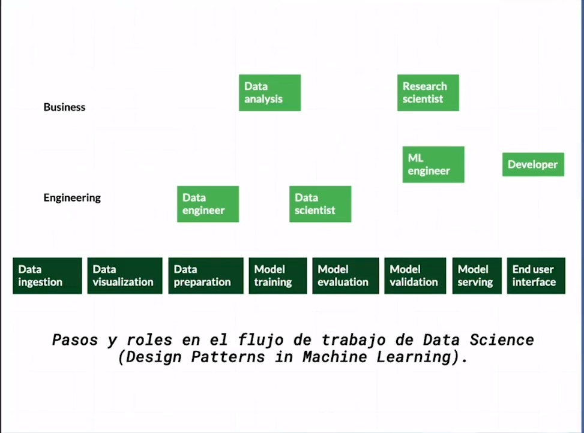
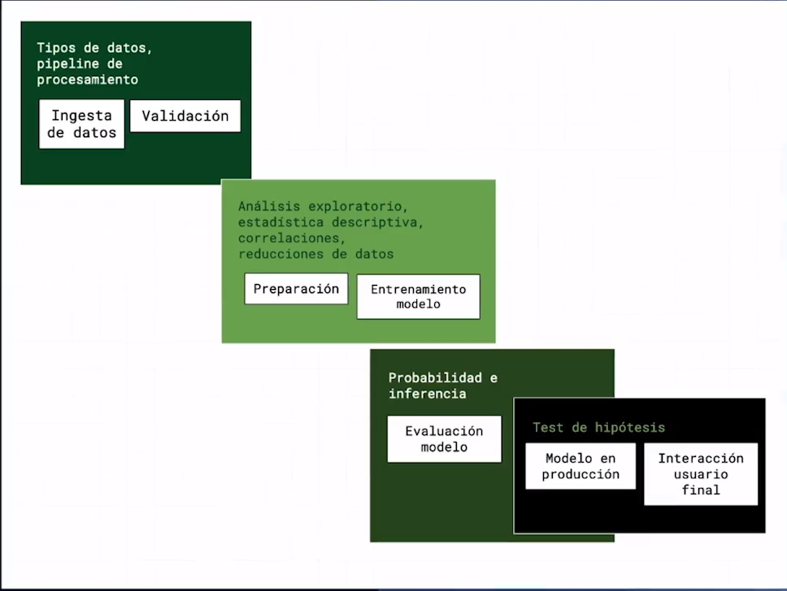
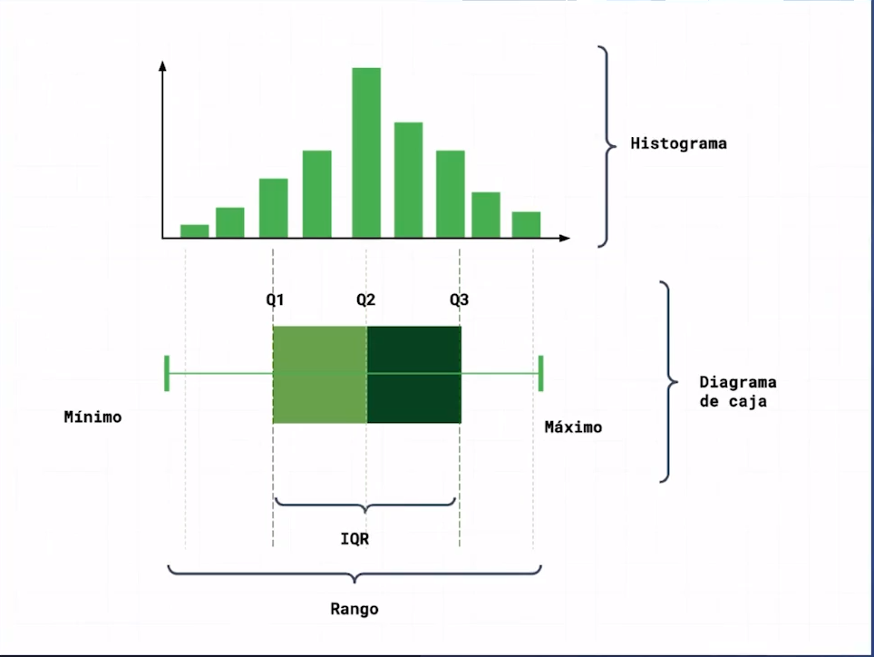
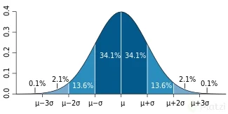

# Datacademy

## Semana 1

https://platzi.com/tutoriales/2681-datacademy/12788-bitacora-reto-dataacademy-semana1/

## ¿Qué es ciencia de datos y big data? ¿Cómo afectan a mi negocio?

La Data Science (o ciencia de datos) les permite saber a las compañías cuál es el siguiente paso que deben tomar. Descubrir patrones de consumo y correlaciones les da una percepción clara del mercado para tomar decisiones inteligentes y seguras.

.
**Características:**

Mejora de la toma de decisiones. Mediante el análisis de datos se mejora la toma de decisiones en la organización. Se trata de reducir los riesgos estudiando la información de clientes, empleados o la que generan sensores localizados en productos. De esta manera, es posible llegar a decisiones efectivas de forma ágil y con máxima probabilidad de éxito.

Costos, eficiencia, entender a los clientes

Información de categorías, de textos y otros

El BigData ayuda a crear un puente entre la empresa y los usuarios finales

Crear una solución matemática a un problema de negocio

## ¿Qué tipo de información podemos analizar?

Los principales tipos de datos que existen

- Datos de las personas
- Datos de transacciones
- Datos de navegacion web
- Datos de Machine 2 Machine
- Datos biométricos

### Datos segun empresas

Amazon - Podría estar recopilando datos de personas para saber sus preferencias, sus datos de edad, ciudad, deseos, así como los datos de transacciones por las compras que realizan los clientes: también, datos de navegación web por los servicios y productos que consulta en su página web. Toda es información puede ser utilizada para presentar publicidad de promociones de productos semejantes a los visitados y complementarios a los comprados.

Apple - Puede recopilar datos de personas de los clientes y usuarios de sus servicios, sus patrones de consumo, preferencias. Podría ser de transacciones en sus plataformas de contenido. Machine 2 Machine entre los dispositivos Apple que se sincronizan. Con ellos, además de publicidad, podrían detectar las preferencias y patrones de comportamiento para innovar en sus productos y fidelizar a sus usuarios.

Google – podría ser donde más huella digital dejamos cuando navegamos, las búsquedas que hacemos, los servicios y herramientas de google. ´También puede usar la información personal, de transacción y navegación para presentar publicidad relacionada con los intereses personales y para innovar en sus productos y servicios.

Netflix – tiene acceso a datos transaccionales y de personas sobre los gustos, tal vez estados de ánimo por el género de series y películas que ven sus usuarios con lo cual pueden presentarle más contenido semejante.

Platzi - Datos de personas, sus necesidades de formación, sus sueños profesionales, hasta sus problemas de aprendizaje, motivación y procrastinación. Con base en ello pueden saber qué cursos podríamos querer y necesitar realizar para no parar de aprender, fortalecernos con las habilidades duras y blandas que requerimos y fidelizarnos.

## ¿Cómo crear empresas y culturas data-driven?

1. Crear una **cultura** de datos
2. **Recoletar** información
3. Medir **todo**
4. Datos **relevantes** y **precisos**
5. Testear y crear **hipotesis**
6. Desde los **insights** de datos a las **acciones**
7. Cumplir las **regulaciones** de datos
8. **Automatizar**

Me parece que estos puntos para crear empresas data-driven, reflejan de una manera global, el proceso de general de la ciencia de datos, y lo que le corresponde a cada rol:
El punto 1. Sería la contextualización de todo el equipo de trabajo y los interesados.
Puntos 2 y 3. De lo que se encargaría el Data Engineer
Puntos 4 al 7. De lo que se encargaría el Data Scientist
Punto 8. De lo que se encargaría el ML Engineer

Esto refleja el impacto que puede tener un equipo de data scientists en toda la organización en general.

    "Tomar información de un lugar y no dar el agradecimiento a la debida persona seria lo mismo que robar"

## Flujo de trabajo en ciencia de datos: fases, roles y oportunidades laborales

1. **Ingeniero de datos**
    Base de datos
    ETLs / APIs
    SQL y NoSQL

    Es el origen de datos, es el arquitecto entre la data cruda y la base de datos. Crean bases de datos. Hacer que los datos se almacenen en su máximo potencial.

2. **Analista/ Business Intelligence**
    Extracción y dashboards
    Automatizacion
    SQL y Excel

    A partir de la información que creo el ingeniero de datos, la lee desde la base de datos, crea cuadros de control, dashboards, monitoreos.

3. **Data Scientist**
    Machine Learning
    Modelos Estadísticos
    R y Python
    SQL

    Tomando los datos usa herramientas estadísticas y de modelos, para predecir y hacer estimación respecto al futuro en base a los datos.

4. **Data translator**
    Data Scientist - Decision Makers
    Destiladores de data
    Expertos necesidad de negocio

    Lider de equipo con especialidades en el negocio que pueda interpretar los datos y dirigir el equipo de hacia dónde enfocarse y que decisiones se pueden tomar con los datos.

## ¿Por qué aprender Python?

A la hora de escoger un lenguaje para crear un sistema en lugar de enfocar que lenguaje es mejor, concentrate mas en el problema y busca que lenguaje de programacion tiene mas campo en resolver ese tipo de problemas.

Areas de desarrollo de software:

- Frontend
- **IOT (Python)**
- **Inteligencia Artificial (Python)**
- **Backend (Python)**
- DevOps
- **Data Science (Python)**
- Videojuegos
- Desarrollo movil

Ventajas de python

- Facil
- Elegante
- Buenas practicas

### Reto

Encuentra uina Aplicacion del dia a dia que este programada con Python en alguna parte de su estructura.

- Pinterest: En esta aplicacion Python es el motor del backend de la pagina.

## El núcleo de un programa los algoritmos

Los algoritmos son una series de pasos para resolver un problema.

Se caracteriza por:

- Serie de pasos ordenados para resolver un problema
- Es Finito
- No es ambiguo

Pueden representarse mediante un diagrama de flujo.

### otras notas

La palabra algoritmo proviene del sobrenombre de un matemático árabe del siglo IX, Al-Khwarizmi, que fue reconocido por enunciar paso a paso las reglas para las operaciones matemáticas básicas con decimales (suma, resta, multiplicación y división).
.

#### ¿Qué es un Algoritmo?

Un algoritmo informático es una secuencia de instrucciones finitas que llevan a cabo una serie de procesos para dar respuesta a determinados problemas. Es decir, un algoritmo informático resuelve cualquier problema a través de unas instrucciones y reglas concisas, mostrando el resultado obtenido.

## El arte de la programación

Python es un lenguaje que tiene una sintaxis sencilla, es fácil de entender, ademas se aplica para muchos campos de la industria.

**Ventajas de Python:**

- Es fácil de usar. Con algunos tips sencillos, cualquier persona puede programar rutinas sencillas en Python.

- Legibilidad del código. La estructura del código es bastante natural y promueve una forma de escribir que facilita su lectura. Esta es una ventaja importante frente a lenguajes dirigidos al mismo sector, como Perl.

- Facilidad de uso en dispositivos. Algunas plataformas como Raspberry Pi están basadas

- Facilidad de escritura de código asíncrono. Los lenguajes diseñados antes de que las plataformas multiprocesador (o multinúcleo) estuvieran tan generalizadas suelen tener estructuras bastante complicadas para mantener distintos hilos de ejecución; en Python el código asíncrono es bastante sencillo de gestionar.

- Abundancia de bibliotecas. Hay muchas bibliotecas disponibles para extender la funcionalidad básica de Python a cualquier campo.

- Gran base de usuarios. Esto hace que exista mucho código disponible en internet y que los foros de usuarios sean bastante activos, por lo que es fácil encontrar ayuda
cuando se necesita.

## Instalación de nuestras herramientas en Windows

En Vscode yo uso, las siguientes extensiones relacionadas con python:

- Python: Extension oficial de Visual Studio Code para python
- Pylance: soporte mejorado de Python para Visual Studio Code
- Magic Python: Resaltado mejorado del codigo
- IPython for Vscode: Corrige bugs conocidos de la extension de python
- Python Docstring Generator: Generador de documentacion de funciones de forma automatica
- Python Indent: Identa correctamente al dar enter en la continuidad de una instruccion
- Python path: Permite con mas facilida importar librerias locales de python

- Jupyter: Extension para usar jupyter notebooks en vscode
- Jupyter Keymap: atajos de teclado para jupyter
- Jupyter Notebooks renderers: Rendered mejorado de graficos para jupyer notebooks

## Tu mejor herramienta: la consola

Cabe destacar que los comandos son independientes del sistema operativo por el motor de consola que usa el profesor. que esta basado en bash el cual es la consola de Linux.
La consola nativa de Windows tiene comandos diferentes o no existen.
y la consola de Mac suele tener diferencias menores ya que es un sitema operativo basado en Unix igual que Linux.

Lo mas notable es que navegar entre carpetas en la consola es diferente en Windows y Linux por el uso del slash hacia la derecha `/` en linux y hacia la izquierda en windows   `\`.

para ver mas informacion de cualquier comando basta con llamar `--help`

ejemplo:

    ```sh
    cd --help
    ```

    ```sh
    ls --help
    ```

    ```sh
    mkdir --help
    ```

### Reto crear carpeta con la fecha de hoy

Imprimir la variable date

    ```sh
    echo $(date)
    ```

Imprimir la fecha de hoy en consola

    ```sh
    echo $(date +"%Y_%m_%d")
    ```

Crear la carpeta con la fecha de hoy

    ```sh
    mkdir $(date +"%Y_%m_%d")
    ```

## Explorando Python: operadores aritméticos

## ¿Qué es una variable?

A un nivel más profundo una variable es la forma en la que definimos un espacio en memoria en la ejecución del programa, esta memoria es la RAM, cada vez que se accede a una variable lo que se hace es pedirle a la computadora que acceda a ese espacio en memoria.

Python al ser un lenguaje de programación de alto nivel, débilmente tipados declarar una variable lo que implica reservar una nueva dirección en memoria es tan simple como declarar el nombre de nuestra variable seguido de la igual seguido de su valor inicial.

**Ejemplo**

    ```python
    mi_suma = 3 + 5
    ```

Una variable es una pieza contenedora de información, la cual posee un nombre como identificador. Una variable puede contener elementos de distintos tipos.

Existen ciertas normas que se deben cumplir para declarar una variable en **python**:

- El nombre de la variable NO debe iniciar con un numero.

- El nombre debe estar en minúsculas.

- Si el nombre de la variable posee varias palabras se deben separar con “_” ya que no esta permitido el uso de espacio.

- Otra regla de las variables que no menciona el profesor es que en todos los lenguajes de programación existen palabras reservadas, algunos ejemplos en python son el if, for, while, def, que son palabras que se utilizan para definir estructuras dentro del mismo lenguaje de programación.
Una variable no puede tener el mismo nombre que una palabra reservada, y de hacerse terminaría en un error de ejecución y el programa no funcionaría.

## Los primitivos: tipos de datos sencillos

En python todo es un objeto, y los objetos pueden ser de distintos tipos.

tipos de datos primitivos en python:

- int: Números Entero
- float: Números Decimales o de punto flotante
- bool: Booleano (Verdadero o Falso)
- String: Cadena de texto

## Convertir un dato a un tipo diferente

Convertir un dato a otro tipo de dato es una operación común en los lenguajes de programación, esta operación se conoce como parseo ('parse' en inglés), siendo lo que se realiza es un parseo de la variable.
En python existen diversos métodos nativos para los tipos de datos primitivos.

- int(x) retorna la variable como un entero

- float(x) retorna la variable como un flotante

- str(x) retorna la variable como un string

- bool(x) retorna la variable como un booleano, cabe destacar que solo retornara falso a los valores falsy , en python son: `0`, `None`, `0.0`, `0j`, `False`

## ¿En qué lugares programar para ciencia de datos?

Para ciencia de datos se suele preferir trabajar en sistemas operativos basados en UNIX o utilizando WSL.

- Para ciencia de datos se suele preferir trabajar en Sistemas Operativos basado en UNIX usando Linux, MacOS o WSL (Windows Subsystem for Linux)

### NoteBooks

Son un entorno eficiente y moderno que combina código, visualizaciones y mapas al vuelo y herramientas de datos. En el editor de notebooks, puede escribir, documentar y ejecutar código de Python en un único lugar.

### Scripts

Un script, secuencia de comandos o guion es un término informal que se usa para designar a un programa relativamente simple. → Es el codigo del programa escrito en texto plano

### NoteBook Vs Script

Ambos son útiles, aunque los Scripts son mas directos,
Notebooks te permiten ver lo que haces, a medida de que lo haces, en estos puedes encargarte de experimentar y hacer el prototipado de tu script y finalmente pasarlo a un Script cuando ya este listo y estés seguro de que todo funciona como es esperado.

## Google Colab: primeros pasos

- Es una herramienta basada en la nube que te permite trabajar en notebooks, y se guardan en tu cuenta de Google Drive 😃.

### Nube vs local

Ambas son muy útiles, pero se diferencian en:

- Configuración de entornos, ya que en la nube ya están precargadas (Librerias, Herramientas Data Science), y de local tienes que configurarlo manualmente.

- Tiempo de ejecución (Mejor en Nube cuando los datos son muy grandes)

- Escalabilidad: la nube tiene más poder porque puedes rentarlo!. 💸

### Que es Google Colab

- Servicio en la nube basado en Jupyter Notebooks,

- No requiere configuración

- Tiene un trabajo a nivel de archivo (el notebook es la base del proyecto).

- Tiene uso de gratuito de GPUs y TPUs para correr modelos grandes. ☁️ (Poder de computo y ejecucion)

### Caracteristicas Google Colab

- Puedes acceder a Google Colab desde tu drive o desde el navegador.
- Para aprender Markdown. [Markdown Guide](https://www.markdownguide.org/) 📚
- Las variables son persistentes (se conservan) entre celdas de código!. 🔥
- Para llamar a la línea de comandos, debemos usar primero un signo de admiración `!` y luego un comando válido, por ejemplo
`!pwd` o `!pip install session-info`

### Instalar Librerias Google Colab

- Instalamos la libreria con el comando `!pip install <Library Name>`

- Importamos la libreria al Nottebook con `import <Library Name>`

### CPU , GPU y TPU

[Diferencias entre CPU-GPU-TPU](https://leslysandra.medium.com/cpu-gpu-tpu-e4a686d3dbc9)

- CPU (central processing unit)
- GPU (graphic processor unit)
- TPU (tensor processing unit)

## Google Colab: ciencia de datos

Herramientas de Google Collab en Ciencia de datos:

- Subir archivos (Al almacenamiento de sesión o Montar Drive)

- Librerias para CD:
  a. matplotlib (Generar gráficos)
  b. numpy (Manipulación de vectores)
  c. pandas (Análisis de datos)
  d. scipy (Herramientas)
  e. seaborn (Visualización)

- Code Snippets (Ejemplos de código que puedes utilizar)

- Keyboard shortcuts (Atajos de teclado)

## Utilizar Deepnote

Que gran herramienta deepnote, especialmente para:

- hacer un portafolio y poder compartir con terceros…

- o trabajar colaborativamente con un equipo de trabajo.

- Puede integrarse con mas aplicaciones.

- Tiene mas tipos de blockes para agregar (Text, Inputs, Other[Chart])


## Tutorial: primeros pasos con NumPy

ver notas en deepnote

## Tutorial: primeros pasos con Pandas

[Tutoriales de Numpy, Pandas y Datascience de Anthony Manotoa](https://platzi.com/blog/autores/anthony_manotoa/)

## Tutorial: cargar archivos CSV con Pandas

## Tutorial: inspección de DataFrames con Pandas

## Estadística descriptiva vs. inferencial

### Estadística descriptiva

Foco principal de este curso

Se enfoca en resumir un historial de datos.

Una de las desventajas que tiene es que **se puede mentir con estadística**, esto se hace al destacar solo la información o métricas que nos convienen.

#### ¿Puedes mentir con estadísticas?

**Si** ejemplo
certificar quien es el mejor jugador de futbol depende de que define al mejor jugador de futbol y podemos montar solo las metricas que cons convengan para respaldar nuestra teoría.

- No hay una definicion objetiva de las cosas

- Los diferentes estadisticos descriptivos dan nociones diferentes sobre los mismos datos.

Las mediciones o métricas de los datos que nos dan información de ellos se conocen como **estadísticos descriptivos**. un ejemplo de esto es la cantidad de goles de un jugador en un campeonato.

    "Con frecuencia construimos un caso estadístico con datos imperfectos, como resultado hay numerosas razones por las cuales individuos intelectuales respetables pueden no estar de acuerdo sobre los resultados estadísticos."

  **-Naked Statistics (Charles Wheelan).**

**Ejemplo:**

Resumir historial deportivo de un jugador.

#### Estadística inferencial: predecir con datos

¿Por qué aprender estadística?
Resumir grandes cantidades de información para tomar mejores decisiones.
Responder preguntas con relevancia social.
Reconocer patrones en los datos.

**Ejemplo:**

Predecir desempeño de un jugador de futbol en el futuro.

### Por qué aprender estadística?

- Resumir grandes volumenes de información siempre es util.
- Tomar mejores decisiones (o peores)
- Responder preguntas con relevancia social (como esta la desigualdad?, como esta la economia?)
- Reconocer patrones en los datos
- Descubrir a quienes usan estas herramientas con fines nefastos. (Descubrir a quienes mienten con estadistica)

**audiolibros sobre los papeles de la estadística**, los sesgos mentales, y hasta como los mejores científicos pueden caer en la desinformación:

- El Cisne Negro, de Nassim Taleb

- Ruido, de Daniel Kahneman

- Pensar Rápido y pensar despacio, de Daniel Kahneman

[Pagina de analisis estadistico de hechos del mundo de hoy](https://fivethirtyeight.com/)

## Flujo de trabajo en data science



En el flujo de un proyecto de machine learning, diversos roles se enfocan en distintas partes del proceso.

- Data Engineer: Se encofoca en la Preparacioncion de los datos
- Data analysis: Se enfoca en el Entrenamiento del modelo
- Data Scientist: Se enfoca en el Entrenamiento y la Evaluacion del modelo
- Research Scientist y ML Engineer: Se enfoca en la Validacion del modelo y Model Serving (Como se le sera servido este modelo al sistema principal)
- Developer: Se enfoca en la Interfaz del usuario final, conectando asi el modelo listo con el sistema principal que usara el usuario final.



En los bloques del procesamiento la estadistica descriptiva juega un rol importante en los primeros dos bloques

1. Ingesta de datos y Validacion de los datos
2. **Preparacion de los datos y Entrenamiento del modelo** (aqui se usa mas)

## Plan del curso y cómo se involucra la estadística en el flujo de data science

### Primer bloque del proceso

- Tipos de datos
- Pipeline de procesamiento

Estadísticos para la **Ingesta de datos** y **Procesamiento de datos/ Validación**

### Segundo bloque del proceso

- Analisis exploratorio
- Estadística descriptiva
- Correlaciones
- Reducción de datos

Estadísticos para la **analítica de datos** y **exploración de datos**

### NUESTRAS DOS FILOSOFÍAS MATEMÁTICAS DESCRIPTIVAS

Dos casos de uso:

- Uso de la estadística para hacer la ingesta y procesamiento de los datos

- Uso de la estadística para hacer la analítica y aplicación necesaria para pasar a Machine Learning Engineer o sacar valor de los datos

## Tipos de datos

Los datos se dividen en dos grupos principales:

**datos categóricos:** (genero, categoría de película, método de pago)

- ordinales (existe una relación de orden en entre las categorías)
- nominales

**datos numéricos:** (edad, altura, temperatura)

- discretos (datos enteros como la edad)
- continuos (datos flotantes como la altura o la temperatura)


## Medidas de tendencia central

### ¿Tendencia central?

- Media (promedio)
- Mediana (valor que esta en la mitad y separa los datos en dos partes iguales)
- Moda (valor que se repite mas veces)

Cabe destacar que una distribución de datos se considera Normal cuando la Media, la Moda y la Mediana se encuentran en el mismo punto.

[Notas de las fórmulas de las medidas de tendencia central](https://github.com/LuisReyes98/platzi-estadistica-data-science-ejercicio/blob/master/%5Bclase-07%5Dmedidas-central.ipynb)

### ¿Cuando usar cual?

- La media es susceptible a valores atipicos

- La moda no aplica para datos numericos continuos (ya que es dificil determinar las categorias por lo cual se usa una nocion diferente)

## Metáfora de Bill Gates en un bar

- Media es el promedio
- Mediana puede ser uno o dos valores dependiendo si la distribucion de datos es par o impar
- Moda es el valor que se repite mas veces

Teniendo un dataset de los salarios de todos los empleados de varias empresas.

Tenemos sus media, moda y mediana.

todos los salarios de los empleados son de 35000 dólares, siendo la **media**, **moda** y **mediana** de sus salarios también 35000 dólares.

Entonces si en el bar hay 11 personas y llega BillGates al bar con un salario de 1 millón de dólares
La **media** del salario ahora es de 115416.6 dólares
La **mediana** es 35000 dólares
y la **moda** es 35000 dólares

por lo cual vemos que la presencia de un valor atípico ocasiona que la media haga parecer que el salario es de las personas es mucho mayor de lo que realmente es, ya que la media tiene es sesgada en la presencia de valores atípico.
Siendo la **mediana** un valor mejor para estos casos ya que no es afectada por valores atípico.

## Medidas de tendencia central en Python

“La estadística descriptiva no son solo números, también son visualizaciones”

## Medidas de dispersión

### Dispersion en una distribución

- Rango
- Rango Inter cuartil
- Desviación estándar

Dado el grafico



En el **histograma** se ve la distribución de datos visualizando la cantidad de datos referente a cada valor y podemos ver que en este caso es una distribución normal.

### Rango

**El Rango** es la distancia o intervalo entre el valor máximo y el valor mínimo de la distribución, el cual está dado por la resta del valor máximo menos el mínimo siendo este la diferencia.

### Cuartiles

**La Rango Inter cuartil** son los puntos que divide los datos en 4 partes iguales:

Siendo el cuartil 2 es la Mediana
El cuartil 1 es la mitad entre la mediana y el valor mínimo
El cuartil 3 es la mitad entre la mediana y el valor máximo

Y la distancia entre el cuartil 3 y el cuartil 1 se conoce como rango Inter cuartil (IQR).

Los cuartiles separan los datos en 4 partes iguales

Los cuartiles son valores que dividen una muestra de datos en cuatro partes iguales

**1er cuartil (Q1):** 25% de los datos es menor que o igual a este valor.
**2do cuartil (Q2):** La mediana. 50% de los datos es menor que o igual a este valor.
**3er cuartil (Q3):** 75% de los datos es menor que o igual a este valor.
**Rango Inter cuartil:** La distancia entre el primer 1er cuartil y el 3er cuartil (Q3-Q1); de esta manera, abarca el 50% central de los datos.

### Diagrama de caja o box plot

representa gráficamente una serie de datos numéricos a través de sus cuartiles. De esta manera, el diagrama de caja muestra a simple vista la mediana y los cuartiles de los datos. También puede representar los valores atípicos de estos.

En la visualización del rango, el rango Inter cuartil y los cuartiles, se muestra en un **diagrama de caja** que es la gráfica por excelencia para mostrar los datos con respecto a **la mediana** en particular.

## Desviación estándar

Dado un dataset de precio de autos

La media es el valor promedio

Media

$$
\mu = \frac {1}{n} \sum \limits_{i=1}^n a_i
$$

Una medida de dispersión muy util se obtiene de calcular la variación de cada punto y calcular la distancia que tiene ese punto del valor promedio.

La distancia puede ser negativa si el valor es menor que el promedio y positiva si es mayor que el promedio.

Ya que las distancias son positivas o negativas los valores se elevan al cuadrado antes de sumarse para que siempre sea un valor positivo

Formula de la desviación estándar

$$
\sigma={\sqrt {\frac {\sum_{n-1}^n(x_{i}-{\mu})^{2}}{N}}}
$$

Considerar también que $\sigma^2$ es la varianza

cuando se trabaja con una muestra de los datos y no con toda la población se realiza una corrección en la formula al dividir entre $n-1$

$$
\sigma={\sqrt {\frac {\sum_{n-1}^n(x_{i}-{\mu})^{2}}{n-1}}}
$$

Una distribución normal tiene la forma de una campana de Gauss. Es simétrica, la media, moda y mediana están en la misma posición.

también que un conjunto de datos normal la distancia entre $\mu -3\sigma$ y $\mu + 3\sigma$ contempla la totalidad de los datos o aproximadamente el 99.72% de los datos.



**Metodo de detección de Outliers con el Rango Intercuartil**
Metodo para descartar datos Outliers consiste en considerar el valor mínimo y máximo de la siguiente manera:

$min = Q1 - 1.5*IQR$

$max = Q3 + 1.5*IQR$

Siendo el rango intercuartil (IQR) la distancia entre Q1 y Q3.

además, este método de detección de Outliers con el Rango Intercuartil se aproximó así que tomaremos los datos en base a $3\sigma$

**Distribucion No Simétrica**
En este caso usar el rango intercuartil igual que antes no es posible, lo que se hace es en lugar de multiplicar por el IQR, se busca una función que dependa del IQR.

$min = Q1 - 1.5*f(IQR)$

$max = Q3 + 1.5*g(IQR)$

además, si la distribución es No simétrica usar la desviación estándar para contemplar la mayoría de los datos ya no es válido, por lo cual el método que debemos aplicar es el uso del rango Intercuartil.
